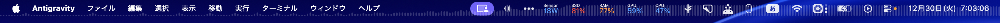
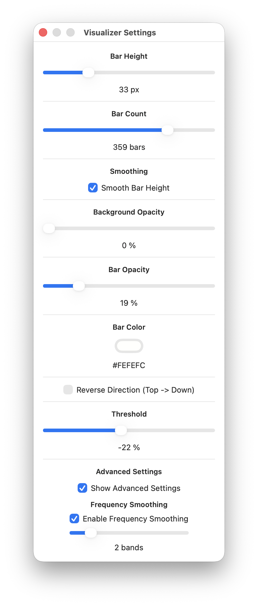

# MenuBarVisualizer

macOSのメニューバーに常駐するオーディオ・ビジュアライザです。画面録音の音声入力を使い、メニューバー最上部にスペクトラムを描画します。



## Features
- メニューバー常駐のミニマルなビジュアライザ
- バー数 / 高さ / 色 / 透明度 / 方向の調整
- 全画面時は自動で非表示
- 周波数方向のスムージング（Advanced Settings）



## Requirements
- macOS 13+

## Build
```sh
./scripts/build_app.sh release
```

生成先: `dist/MenuBarVisualizer.app`

## Usage
起動後はメニューバーの波形アイコンから設定を開けます。

## Permissions
以下の許可が必要です。
- Screen Recording（音声取得のため）
- Accessibility（全画面時の自動非表示のため）

## Advanced Settings
- **Enable Frequency Smoothing**: 周波数方向のギザギザを抑えて滑らかに表示
- **Frequency Smooth Radius**: 平滑化の強さ（大きいほど滑らか）
